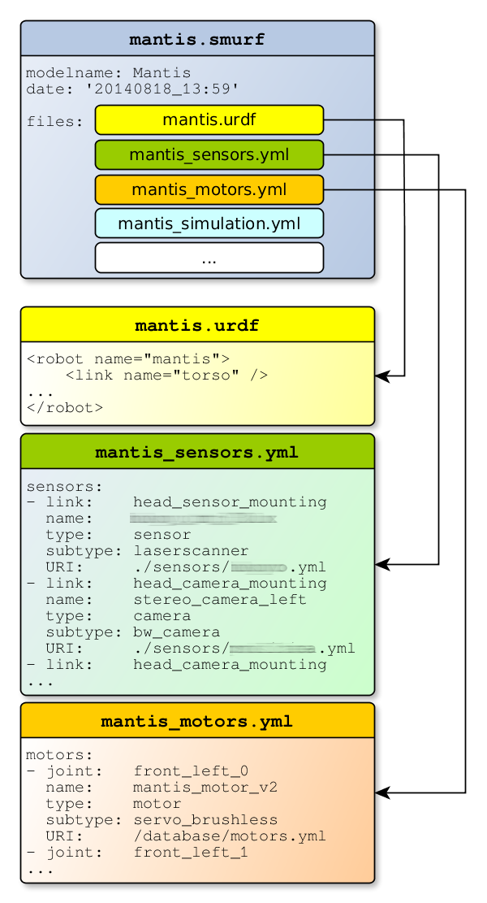

# SMURF Parser

When reading in a SMURF robot representation, the SMURF parser yields a [boost::shared_ptr](http://www.boost.org/doc/libs/1_57_0/libs/smart_ptr/shared_ptr.htm) to a [URDF model](https://github.com/ros/urdfdom_headers/blob/master/urdf_model/include/urdf_model/model.h) as well as a [ConfigMap](https://github.com/rock-simulation/configmaps) containing the annotations contained in the SMURF's YAML files (see below).

---

# SMURF

## What is SMURF?

SMURF stands for Supplementable, Mostly Universal Robot Format and is an attempt to overcome the limitations of URDF (and SRDF) to create a more versatile format that can be easily adapted to the needs of different groups of users and projects.

## Structure

SMURF is not so much a format for a single file but rather defines a hierarchy of files that together provide information on different aspects of a robot. Thus a SMURF robot definition consists of one main .smurf file containing general data on the model and a list of files that should be included in the SMURF representation of the robot. At a minimum, a .urdf file that defines the robot’s kinematics is listed here. Normally, the list will also contain other files - encoded in the YAML format - defining different parts of the robots such as sensors, motors or additional data, e.g. simulation parameters.

*Example SMURF representation of the [Mantis](http://robotik.dfki-bremen.de/en/research/projects/limes-1.html) robot (some names blurred to not promote particular hardware)*

In these YAML files, information can be linked to specific parts of the robot by referencing them by type and name as specified in the URDF (combinations of type/name are unique in URDF). For instance, a sensor can be defined by attaching it to a link, then specifying its update rate and other parameters. Similarly, motors can be attached to joints, specifying maximum torques and turning speeds. This information does not have to be provided redundantly, as it is possible to define URIs of additional YAML files containing the data which is not explicitly listed in an entry. This makes it possible to maintain a central database of devices used multiple times in the same robot or even in different robots, without the need to update every single model independently if any single part changes and thus reducing repetitive workload and errors.

## Extensibility

Apart from a core set of defined features such as the ones listed above, SMURF provides the user with the freedom of specifying any kind of information related to any part of the robot or the model as a whole, using a subset of the YAML syntax. The existing C++ SMURF parser recursively traverses the entire SMURF file tree and provides all the data of the model in an easy-to-work-with data format called a ConfigMap, which is a C++ implementation of a Python dictionary using templates. The parser was originally part of the [MARS simulation](http://github.com/rock-simulation/mars), but has since been turned into a separate library.

## Compatibility & Editing

SMURF is compatible with the [MARS simulation](http://github.com/rock-simulation/mars) and will be compatible with future versions of the Rock robotics framework. URDFs contained in SMURF do not have any custom tags and are thus compatible with the ROS robotics framework and the Gazebo simulation.
Phobos is a plugin for the free 3D modelling software Blender, turning the latter into a powerful tool for creating and editing SMURF robot models. It is itself open source software, distributed under the LPGL license, and is [hosted on GitHub](http://github.com/rock-simulation/phobos).
